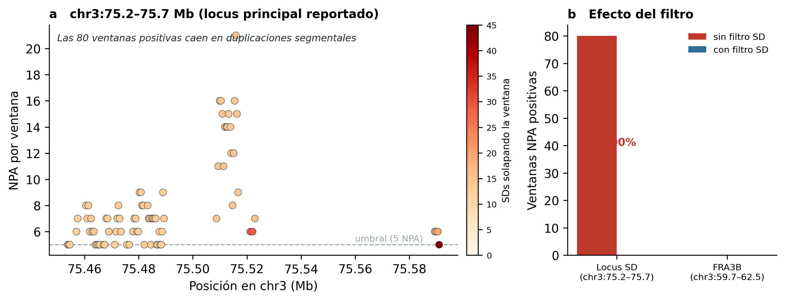
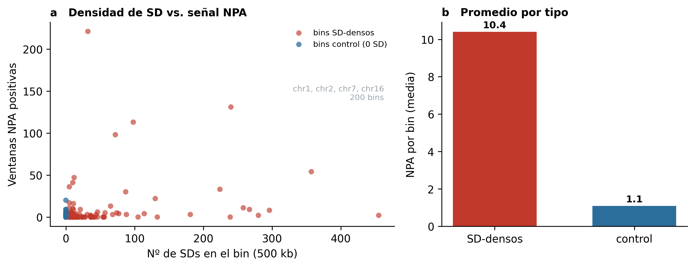

# NPA-SD-artifact

Reanalysis of the non-parental-allele (NPA) clusters reported by
Myakishev-Rempel (2025), which were interpreted as traces of non-human genetic
manipulation in roughly 2% of individuals. The clusters are mapping artifacts:
they sit in segmental duplications, where short reads from near-identical
paralogs misalign and produce genotypes that look non-parental. Filtering
segmental duplications removes the signal.

This repository reproduces the original scan and the corrected, SD-aware version
on the same data, so the difference can be checked directly.

## Background

In a parent–parent–child trio, a *non-parental allele* is an allele the child
carries but neither parent does. Real cases are rare (de novo mutation, gene
conversion); most apparent cases are genotyping error or read misassignment. The
original report scanned 1000 Genomes trios for windows enriched in NPAs on
chromosome 3 and read the recurrent clusters as engineered, non-human sequence.

## Where the original analysis breaks down

1. **Segmental duplications are not excluded.** Segmental duplications (SDs) are
   paralogous blocks >1 kb at ≥90% identity, ~5% of the genome, often >98%
   identical. Short reads from one copy align to another, so paralog differences
   surface as heterozygous or non-parental genotypes. The three strongest
   reported clusters fall inside SD blocks of up to 100% identity with paralogs
   on chromosomes 4, 8, 11, 12 and 16. Once SD windows are removed, the signal at
   the strongest locus drops from 80 positive windows to 0 (`scripts/01`).

2. **No correction for multiple testing.** The sliding-window scan implies on the
   order of 5.8×10⁷ window–trio comparisons. The reported clusters are not
   evaluated against any genome-wide significance threshold (a Bonferroni cutoff
   would be near 8.6×10⁻¹⁰).

3. **Chromosome 3 generalized to the whole genome.** The empirical scan covers
   only chromosome 3 (~2.3% of the genome), but the 2% prevalence claim is stated
   genome-wide. When the SD-vs-control test here is run across chromosomes 1, 2, 7
   and 16, the NPA signal tracks SD density everywhere (`scripts/02`).

4. **Interpretation drawn from non-peer-reviewed sources.** Half of the cited
   references are popular books rather than primary genetics literature.

## Results

| Test | Without SD filter | With SD filter |
|---|---|---|
| chr3:75.2–75.7 Mb (strongest reported locus) | 80 windows | 0 windows |
| FRA3B chr3:59.7–62.5 Mb (SD-free control) | 0 windows | 0 windows |
| Genome-wide, SD-rich bins (mean per bin) | 10.4 | — |
| Genome-wide, control bins (mean per bin) | 1.1 | — |

Across 200 bins (chr1, chr2, chr7, chr16), 1,040 of 1,149 positive windows fall
in SD-rich bins. One control bin (chr16:88.5–89.0 Mb) carries a residual signal
across seven unrelated trios; it lies in subtelomeric 16q24.3, where short-read
genotyping is unreliable, and cannot be confirmed without long-read data
(`scripts/03`).




## Install

```bash
git clone https://github.com/Vlattice/NPA-SD-artifact.git
cd NPA-SD-artifact
pip install -e .
```

`bcftools` must be on the PATH for region extraction
(`conda install -c bioconda bcftools` or `apt-get install bcftools`).

## Usage

```bash
# 1. reproduce and refute the chromosome-3 result
python scripts/01_reproduce_chr3.py --cache data --out results

# 2. genome-wide SD-vs-control comparison (resumes if interrupted)
python scripts/02_genome_wide.py --chroms chr1 chr2 chr7 chr16 --out results

# 3. evaluate the subtelomeric candidate
python scripts/03_evaluate_candidate.py --cache data --out results
```

Each chromosome VCF is ~1–2.5 GB; it is cached in `data/` and resumed on
re-run, and `scripts/02` writes one row per bin so an interrupted run picks up
where it stopped.

## How the scan works

`npa_sd.scan` reads a VCF with `cyvcf2`, restricts genotypes to trio members, and
slides a window of 60 biallelic SNVs (step 20) along the chromosome. For each
SNV it tests, vectorized across all trios, whether the child carries an allele
absent from both parents; a window is reported for a trio at ≥5 such alleles.
These parameters reproduce the original scan; the SD filter is the only addition.
`tests/test_npa.py` checks the vectorized test against the set-based definition.

## Layout

```
src/npa_sd/      package: data, sd, npa, genome_wide, candidate, figures
scripts/         numbered, runnable analyses (01–03)
tests/           equivalence test for the NPA logic
docs/            figures
data/, results/  inputs and outputs (git-ignored)
```

## Data

- 1000 Genomes high-coverage release (3,202 samples, GRCh38; 602 complete trios).
- UCSC GRCh38 GenomicSuperDup track (54,714 SD intervals).

URLs are in `src/npa_sd/config.py`.

## Citation and license

See `CITATION.cff`. Released under the MIT License.
